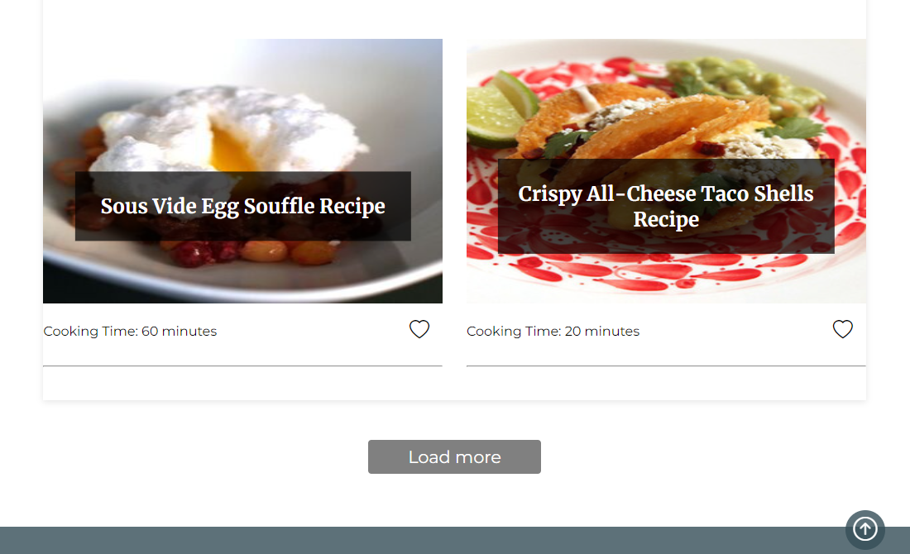
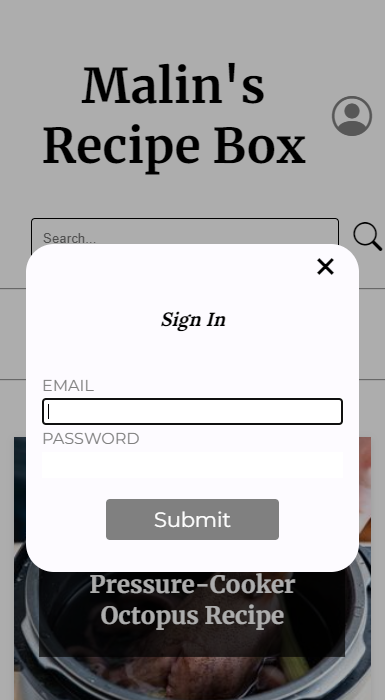
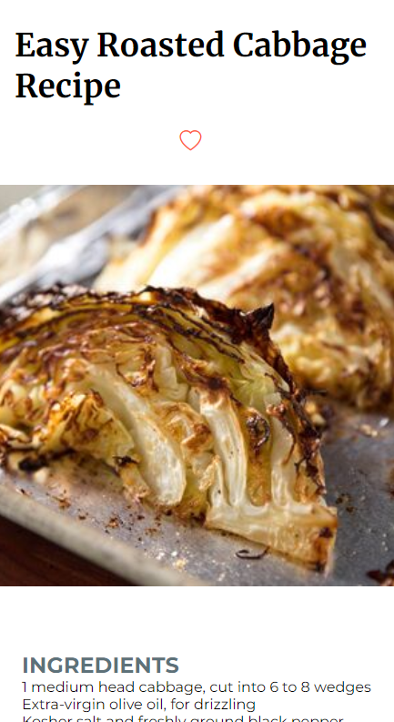

# Recipe Search Application - Malin's Recipe Box

A web-based recipe search application using Angular for the frontend and Laravel for the backend, 
powered by the Edamam API and Laravel Sanctum for user authentication.

I have used the following technologies:
- **Angular** 18.2.0
- **Node.js** 20.16.0
- **Laravel** 10.0
- **Sanctum** 3.3
- **MySQL**
- **Docker** for dev container

## Features
- **Recipe Suggestions**: Get recipe suggestions from a user friendly list. Click on them to see details.
- **Filters**: Filter you recipe search by meal type (breakfast, dinner, teatime) and diet preferences (gluten-free, vegan, vegetarian).
- **User authentication**: Secure user login and registration via Laravel Sanctum.

## Installation

### Prerequisites
- Node.js
- Angular CLI
- Composer
- MySQL 
- Dev container / Docker 

### Steps
- Clone the repository
- You need an API key and App key from Edamam (https://www.edamam.com/)
- Configure API key and App key in the RecipeApiService file
- If you are using localhost, update URLs in the AuthService file and .env file
- Update database credentials in .env file in Laravel directory

**For Docker**:
- Navigate to .devcontainer directory and run "docker compose up" to build and start the containers

**For Angular**:
- Navigate to malins-recipe-box directory and run "npm install" 
- To start the server run "ng serve"

**For Laravel**:
- Navigate to RecipeAPI directory and run "composer install"
- To start the server run "php artisan serve"

- To set up database schema, run the following command in the Laravel directory: "php artisan migrate"

## Usage in localhost
- Frontend is accessible at http://localhost:4200
- Backend is accessible at http://localhost:8000
- Database (adminer) is accessible at http://localhost:8080

